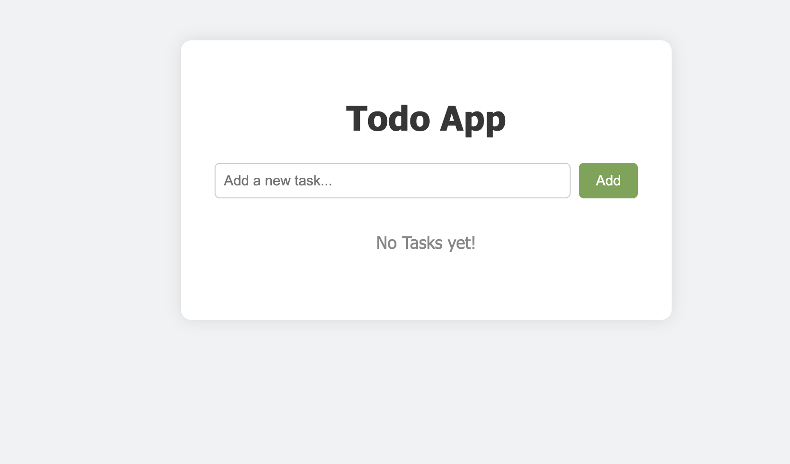
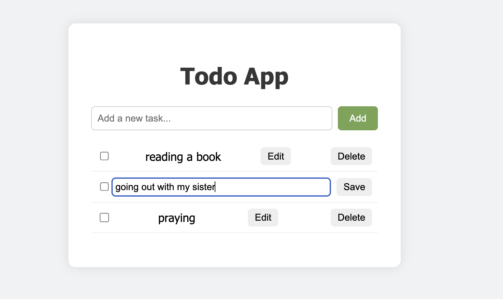
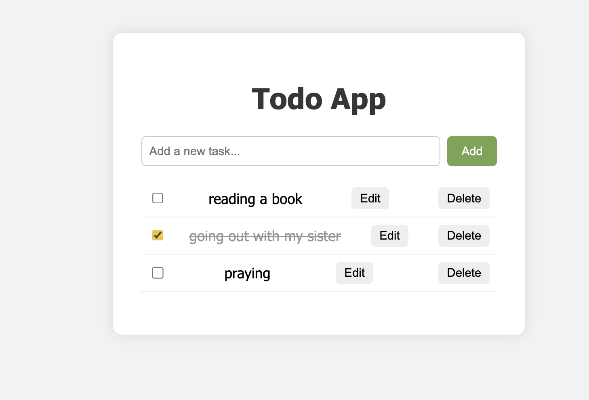

# 📝 React + TypeScript Todo List Application

This project is a Todo List application built using **React**, **TypeScript**, and **CSS**.  
It demonstrates core concepts such as components, hooks, props, state management, and TypeScript type definitions.

---

## 📸 Screenshots

> Add your images (1.png, 2.png, 3.png) inside the `public/` folder or `src/assets/`, then update the paths below.

  
  


---

## 🎯 Project Requirements

This project was created to fulfill the following requirements:

- Learn how to use **React with TypeScript**
- Create reusable **components** and use **React hooks**
- Style the application using **CSS**
- Build a functional Todo List that allows users to:
  - Add tasks
  - Edit tasks
  - Delete tasks

---

## 🚀 Features

- Add new todos  
- Edit existing todos  
- Delete todos  
- Clean and simple UI  
- Fully typed with TypeScript  
- Component-based architecture  

---

## 🛠️ Tech Stack

- **React**
- **TypeScript**
- **Vite**
- **CSS**

---

## 📦 Installation & Setup

Follow these steps to run the project locally:

### 1️⃣ Clone the repository
```bash
git clone https://github.com/your-username/your-repo-name.git


2️⃣ Navigate into the project folder
cd your-repo-name

3️⃣ Install dependencies
npm install

4️⃣ Run the development server
npm run dev


The app will start on:
http://localhost:5173

🏗️ Build for production
npm run build

📤 Deployment Instructions

Push the project to your GitHub repository
Make sure your README.md is included
Add your repository link to the Progress Tracker Google Sheet
